# Local Legend App – Performance & Infrastructure Analysis


> **A hands-on performance analysis of a local marketplace Android app**

---

## Overview

I came across the [**Local Legend app**](https://play.google.com/store/apps/details?id=com.theskillguru.locallegend&pcampaignid=web_share) on the Google Play Store - a marketplace connecting local sellers with nearby buyers. With only 500+ downloads and a recent update, I was curious about how it performs in real-world usage. So I decided to download it and run some tests.

> **What I found was eye-opening:** The app has significant performance bottlenecks that are likely affecting user retention and growth. This analysis documents those issues through hands-on testing and explores potential solutions.

---

## Testing Approach

Rather than just reading reviews, I took a practical DevOps approach:

- Timed app launches with a stopwatch
- Monitored battery consumption
- Tracked data usage
- Tested location accuracy
- Tested search, categories, and browsing
- Documented everything with screenshots

**Test Environment:**

```
Device: Xiaomi Note 11
Network: 4G Mobile Data
Location: Jamnagar, Gujarat, India
Duration: ~18 minutes
Testing Method: Real-world usage simulation
```

---

## App Info

### Installation

<div align="center">

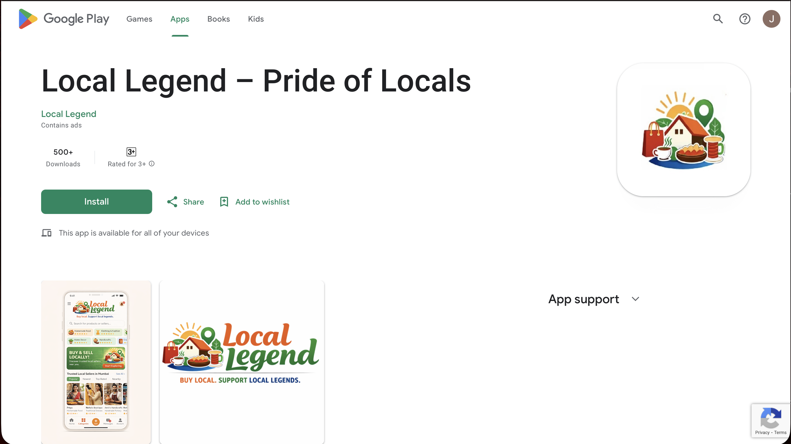

*Available on Google Play Store with 500+ downloads*

</div>

---

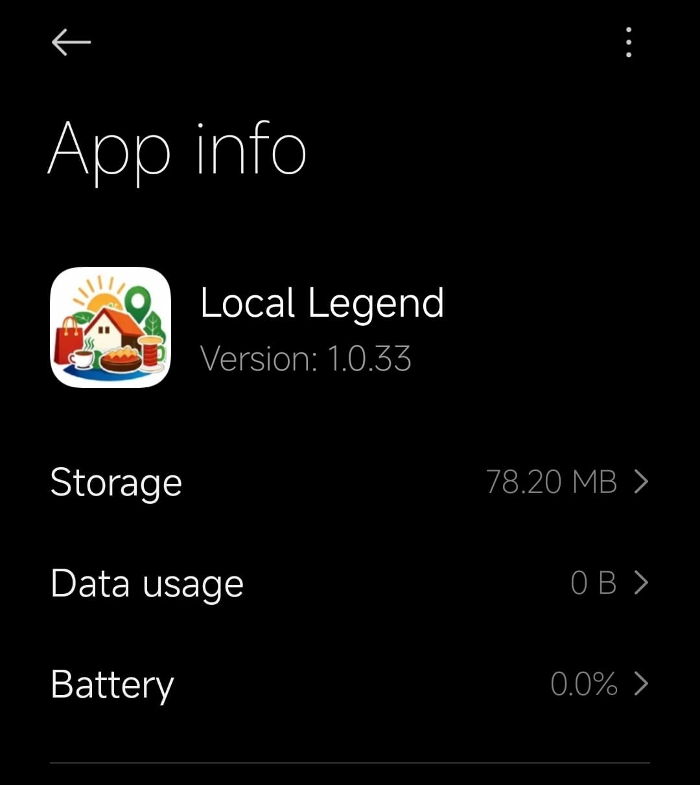

#### **Quick Facts:**

- **Name** : Local Legend - Pride of Locals
- **Size** : 78.20 MB
- **Version** : 1.0.33
- **Category** : Business
- **Downloads** : 500+
- **Last Updated** : December 29, 2025
- **Developer** : The Skill Guru Foundation

---

#### **Purpose:** Connect local sellers (home chefs, artisans, boutiques) with nearby customers.

**Key Features:**

- **Snap & Sell** - Quick product listing
- **Nearby Deals** - Location-based discovery
- **Direct Chat** - Seller communication
- **Store Listings** - Browse by category

---

### Permissions

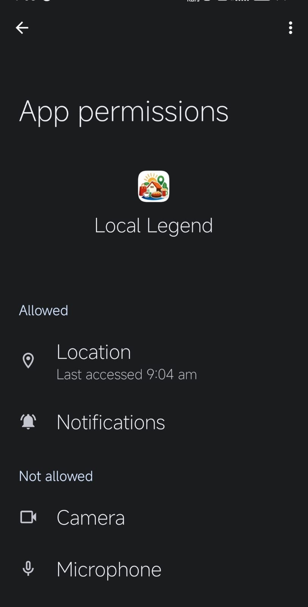

The app requests:
- Location (for nearby sellers)
- Notifications (for updates)

---

## Performance Tests

### Test 1: Cold Start (First Launch)

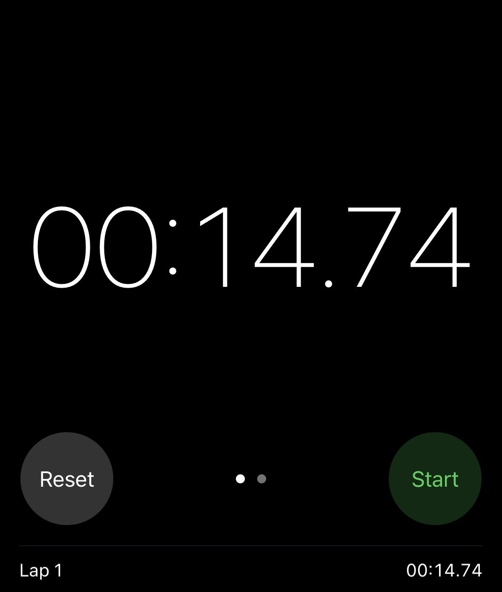

> **Measured: 14.74 seconds**

**Process:**
1. Tapped app icon (started timer)
2. Location permission popup
3. Onboarding screen
4. Home page loaded (stopped timer)

**Analysis:**

This is **3x slower** than industry standard (3-5 seconds). Research shows 53% of users abandon apps taking more than 3 seconds to load.

**Possible causes:**
- App likely downloading large amounts of data at startup (product listings, seller data)
- Images and assets probably not optimized or cached
- Heavy initialization processes blocking the UI thread

---

#### Home Page

<div align="center">

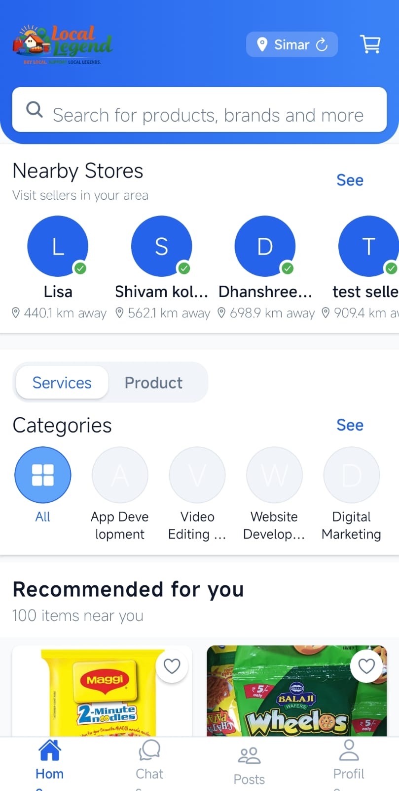

*Once loaded, the home page displays featured products and nearby stores*

</div>

---

### Test 2: Warm Start (Second Launch)

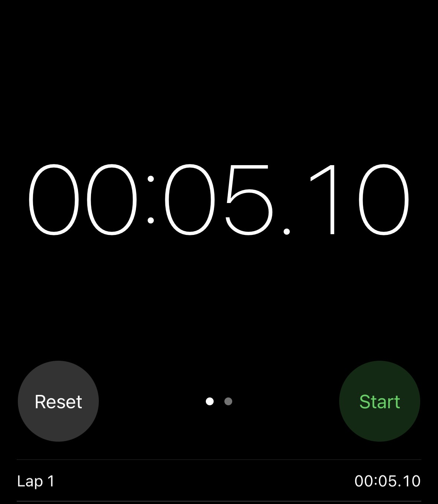

> **Measured: 5.10 seconds**

Better than cold start but still **2x slower** than competitors like Meesho or Dunzo.

---

### Test 3: Search Performance

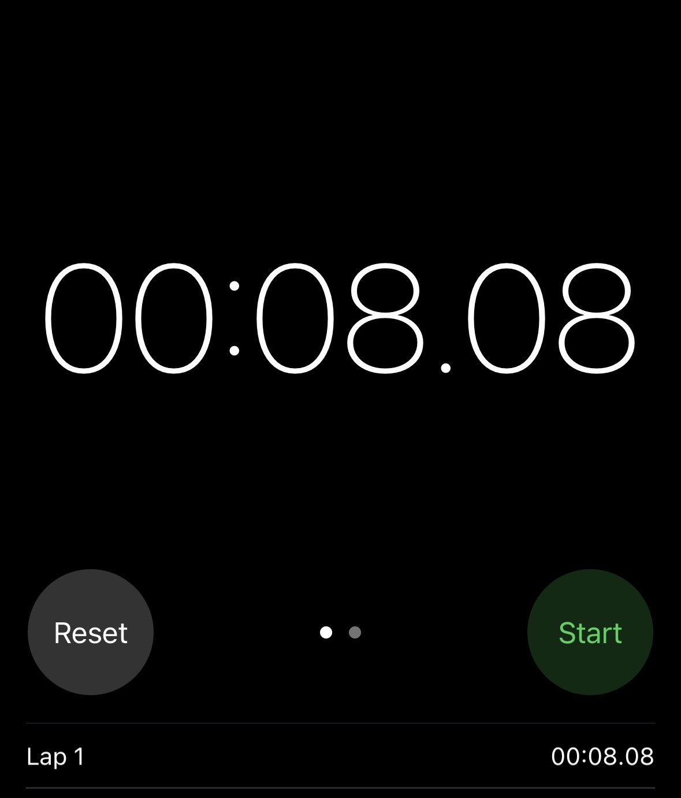

**Query:** "Cake"  

> **Measured: 8.08 seconds** (until images fully loaded)

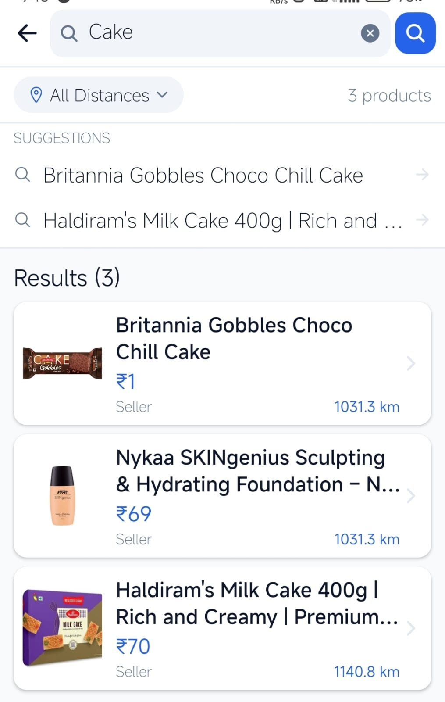

**Issues observed:**
- App says "Showing 3 instant results" - but took 8 seconds!
- All products are 1000+ km away from my location (Jamnagar)
- Images loaded slowly, one by one
- No lazy loading or progressive rendering

**Likely reasons:**
- Images probably being fetched from server without caching
- No CDN implementation - direct server requests every time
- Full-resolution images loaded even for thumbnails

---

### Test 4: Battery & Data Impact

#### Battery Consumption

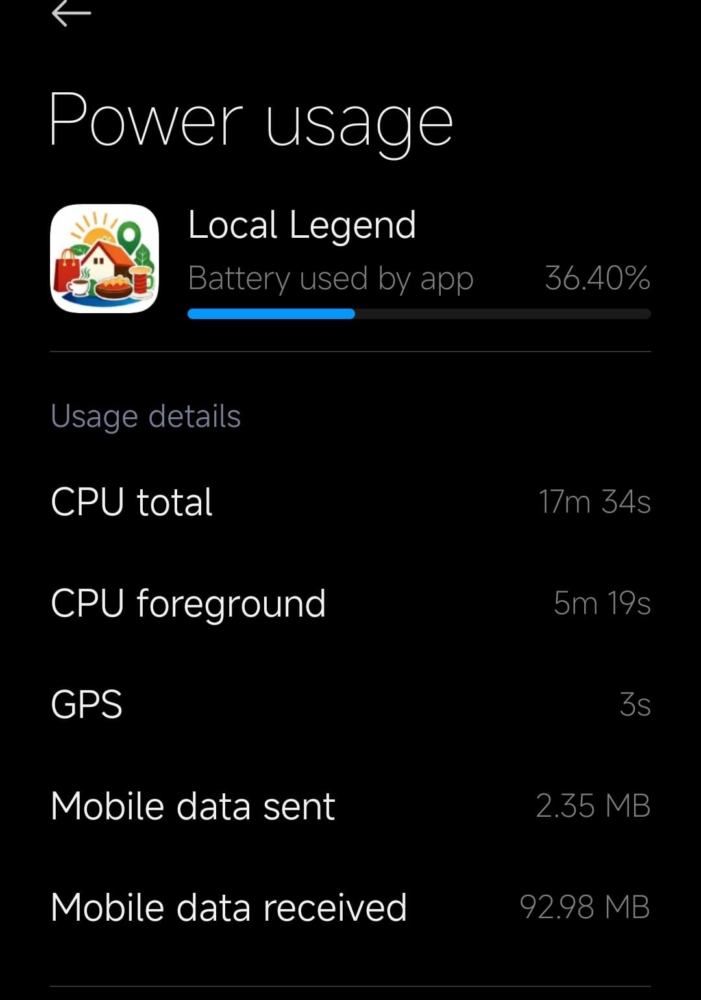

> **Battery Drain: 36.40% in 18 minutes**

At this rate, the phone would die in approximately **50 minutes** of continuous app usage.

**Why this matters:** Users can't browse for extended periods, especially on older devices.

**What might be causing this:**
- Continuous network activity (frequent API calls)
- Images loading in foreground without proper caching
- Location services running constantly in background

---

#### Data Usage


> **Data Consumption: 95 MB in 18 minutes**

That's approximately **5 MB per minute** - which is higher than watching YouTube videos!

**Impact for users:**
- Most Indian users have 1-2 GB monthly data plans
- This app would consume **entire monthly data in 4-5 shopping sessions**
- Makes the app expensive to use for the target demographic

**Root cause analysis:**
- Uncompressed images (likely 2-3 MB each)
- No image caching - same images downloaded repeatedly
- Probably serving full-resolution images instead of thumbnails

---

## Critical Issues Discovered

### Issue 1: Location Accuracy Problem

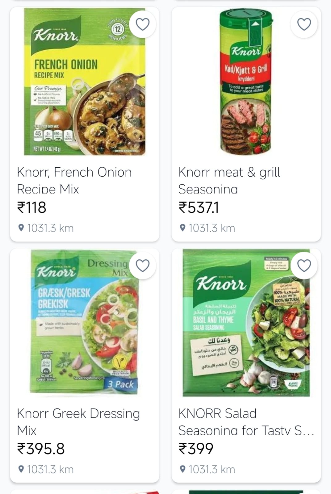

| | |
|---|---|
| **My Location** | Jamnagar, Gujarat |
| **App Shows** | Products from 900-1000+ km away |

---

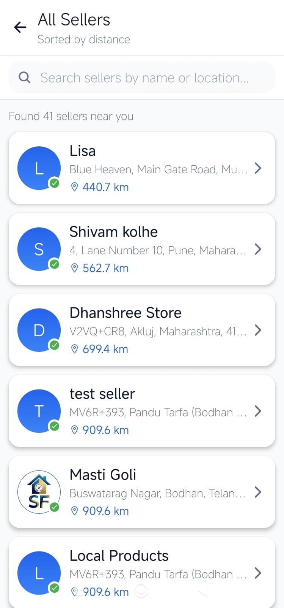

The "nearby sellers" feature shows:

| Seller | Distance |
|--------|----------|
| Lisa | 440.7 km away |
| Shivam kolhe | 562.7 km away |
| Dhanshree Store | 699.4 km away |
| Most products | 1000+ km away |

> **Impact:** This completely defeats the purpose of a "LOCAL" marketplace app. Nobody will buy groceries or everyday items from sellers 1000 km away.

**What's probably happening:**
- Database query might not have proper geospatial indexing
- Location coordinates captured correctly but backend returns wrong results
- Possibly using basic distance calculation instead of proper geolocation queries

---

### Issue 2: Slow Image Loading

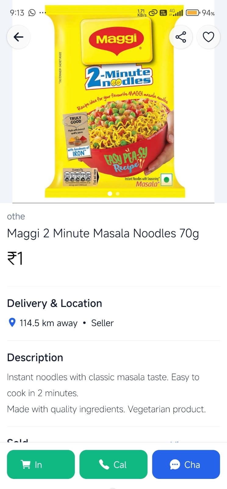

**Problems:**
- Images take 3-5 seconds to load
- Don't load during fast scrolling
- Very large file sizes (2-3 MB per image)
- No caching or optimization

**Likely implementation:**
- Direct server requests for each image
- No progressive image loading (blur-up effect)
- Missing lazy loading implementation

---

### Issue 3: Poor Search & Categorization

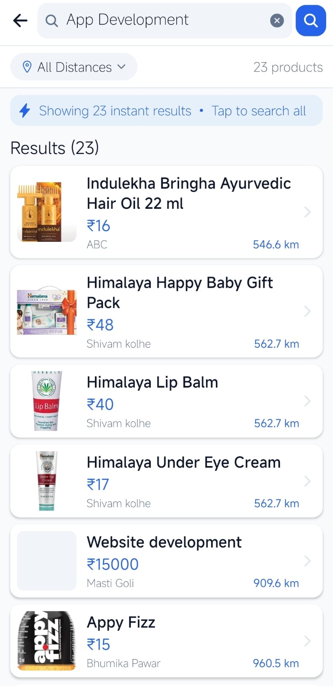

**Example:** Searched for "App Development"

| Expected | Got |
|----------|-----|
| App development services | Beauty products, hair oil, home goods |

> **Root cause:** Poor data quality, no category validation, broken search algorithm.

**What seems to be missing:**
- Proper search indexing (probably using basic SQL LIKE queries)
- Category validation when sellers add products
- Search ranking/relevance algorithm

---

### Issue 4: Missing Product Information

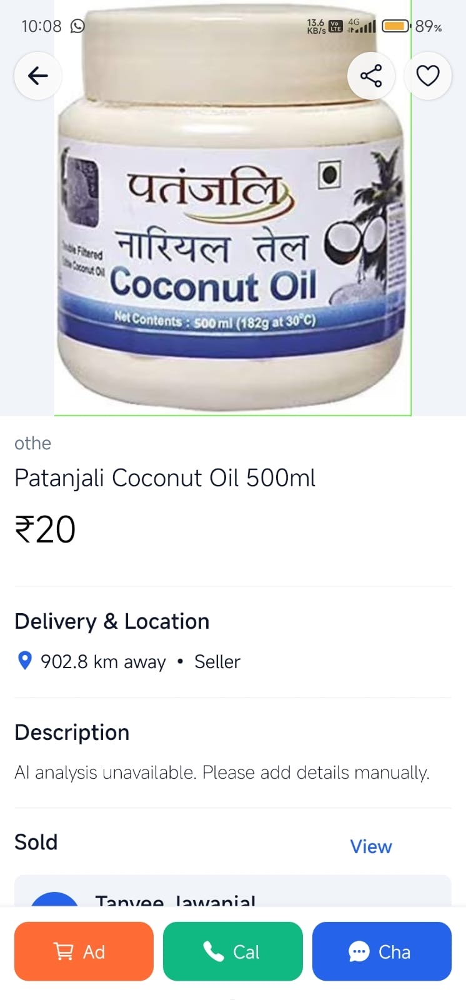

> Many products display: **"AI analysis unavailable. Please add details manually."**

No descriptions, no ingredients, no details - just placeholder text. This makes purchasing decisions impossible.

---

### Issue 5: Limited Product Catalog

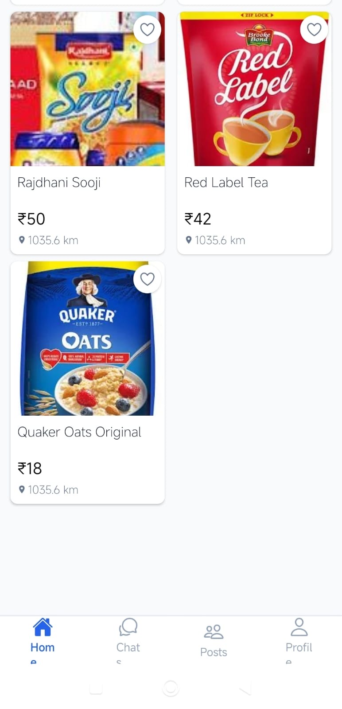

After scrolling through categories for 10 minutes, I reached the end. Very few products available despite 500+ downloads.

> **Why this matters:** Limited inventory means users won't return. There needs to be enough variety to keep users engaged.

---

## Why Cloud Solutions?

After analyzing these issues, it became clear that most problems stem from infrastructure limitations rather than code bugs. The app needs:

- **Global content delivery** for faster image loading
- **Scalable database** that can handle traffic spikes without crashing
- **Proper geospatial queries** for accurate location-based results
- **Automatic scaling** to manage varying user loads
- **High availability** to prevent downtime during peak usage

---

### Why AWS Specifically?

While there are multiple cloud providers (AWS, Google Cloud, Azure), I chose to explore **AWS solutions** for this analysis because:

1. **Mature CDN service** - CloudFront has edge locations across India (Mumbai, Delhi, Chennai, Bangalore, Hyderabad) perfect for an India-focused app
2. **Strong database offerings** - RDS with PostGIS extension is ideal for geospatial queries
3. **Serverless ecosystem** - Lambda and API Gateway work seamlessly for reducing costs during low traffic
4. **Market leader** - 32% cloud market share, extensive documentation, large community
5. **Startup-friendly** - AWS credits and startup programs available

> That said, Google Cloud (with Cloud CDN, Cloud SQL, Cloud Functions) or Azure (with Azure CDN, Azure Database, Azure Functions) could achieve similar results. The principles remain the same across providers.

Here are three specific AWS services that could address the issues I found:

---

## Proposed Solutions

### Solution 1: Amazon CloudFront (CDN)

**What it is:** Global content delivery network that caches images and data closer to users.

**Problems it solves:**
- Slow image loading (8 sec → 1-2 sec)
- High data usage (95 MB → 30 MB per session)
- Images not loading during scroll
- Poor user experience

---

**How it works:**

```
Current:
User → Server (Mumbai, 900 km) → Download 2 MB image → 5-8 seconds

With CloudFront:
User → Edge Location (Ahmedabad, 200 km) → Cached 300 KB compressed image → 0.5 seconds
```

**Expected improvements:**

| Metric | Improvement |
|--------|-------------|
| Image loading speed | 75% faster |
| Data usage | 70% reduction |
| Scroll performance | Instant loading |
| Network experience | Better on slow connections |

---

### Solution 2: Amazon RDS with Read Replicas

**What it is:** Managed database service with automatic backups and multiple database copies for read operations.

**Problems it solves:**
- Slow search queries (8 sec → 1-2 sec)
- Wrong location/distance data
- Inconsistent category information
- Database crashes during high traffic

---

**How it works:**

```
Current:
Single database handles everything → Overloaded → Slow

With RDS:
├── Primary DB: Handles writes (orders, updates)
├── Read Replica 1: Handles searches
├── Read Replica 2: Handles browsing
└── Auto-failover: Backup takes over if primary fails
```

**For location accuracy:**

> Using PostgreSQL with PostGIS extension for proper geospatial queries instead of returning random sellers.

**Expected improvements:**

| Metric | Improvement |
|--------|-------------|
| Search speed | 75% faster |
| Location accuracy | Within 5-10 km (not 1000 km!) |
| User capacity | 10x more users |
| Uptime | 99.9% with automatic failover |

---

### Solution 3: AWS Lambda + API Gateway

**What it is:** Serverless computing - run code without managing servers, pay only for execution time.

**Problems it solves:**
- Slow startup (14 sec → 2-3 sec)
- High battery drain (36% → 12-15%)
- Can't handle traffic spikes
- High infrastructure costs during low traffic

---

**How it works:**

```
Current:
App waits for everything to load → 14.74 seconds

With Lambda:
1. Show cached products immediately (1-2 sec)
2. Load location in background
3. Update UI progressively
4. User can browse right away!
```

**Expected improvements:**

| Metric | Improvement |
|--------|-------------|
| Startup speed | 80% faster |
| Battery consumption | 60% less drain |
| Scalability | 1 to 10,000 users automatically |
| Cost efficiency | 90% reduction during low traffic |

---

## Real-World Scenario: Traffic Surge

**Situation:** App gets featured in a local news article or social media post, bringing 500-1000 simultaneous users (10-20x normal traffic)

---

### Without Proper Infrastructure

**Timeline:**

| Time | Event |
|------|-------|
| **Minute 1** | Traffic starts increasing from article shares |
| **Minute 5** | Server CPU hits 90%, app becomes sluggish for everyone |
| **Minute 10** | Database connection pool exhausted, new users see errors |
| **Minute 15** | Server crashes from overload, app stops working |
| **Minute 20** | Developer gets alert |
| **Minute 45** | Server manually restarted, but traffic surge has passed |
| **Hour 2** | Back online, but the opportunity window is closed |

**Impact:**

- **Downtime:** 30+ minutes during peak interest
- **User experience:** First-time users can't browse, leave immediately
- **App rating:** New users leave 1-star reviews ("app doesn't work")
- **Word of mouth:** People tell others "don't bother, app is broken"
- **Missed growth:** Can't convert the traffic surge into regular users
- **Seller frustration:** Local sellers lose potential customers during peak visibility

---

### With Scalable Cloud Infrastructure

**Timeline:**

| Time | Event |
|------|-------|
| **Minute 1** | Traffic increases detected automatically |
| **Minute 2** | CloudFront serves product images from cache (no server overload) |
| **Minute 3** | Lambda functions auto-scale to handle increased API requests |
| **Minute 5** | RDS read replicas distribute database queries across multiple instances |
| **Minute 10** | System smoothly handling 1000 users browsing simultaneously |
| **Developer** | Gets notification of increased traffic, but system is stable |

**Result:**

- **Downtime:** 0 seconds - app works perfectly
- **User experience:** Fast and smooth even during surge
- **App rating:** Positive reviews from good first impression
- **Word of mouth:** "This app actually works well!"
- **Growth captured:** Traffic converts to regular users and sellers
- **Seller success:** Local sellers gain new customers during visibility spike

> **This is why cloud infrastructure matters - it lets you capitalize on growth opportunities instead of crashing during them.**

---

## Expected Results Summary

| Metric | Before | After | Improvement |
|--------|--------|-------|-------------|
| **App Startup** | 14.74 sec | 2-3 sec | 80% faster |
| **Search Time** | 8 sec | 1-2 sec | 75% faster |
| **Data Usage** | 95 MB/session | 25-30 MB | 70% less |
| **Battery Drain** | 36% in 18 min | 12-15% | 60% better |
| **Location Accuracy** | 1000 km away | 5-10 km | Fixed! |
| **System Uptime** | Hours of downtime | 90 seconds | 99.9% |

---

## Key Takeaways

This analysis taught me:

1. **Performance matters** - Even with a good idea, poor performance kills apps
2. **Data is expensive** - 95 MB for basic browsing is unsustainable for Indian users
3. **Location is critical** - For a "local" app, wrong location data is a dealbreaker
4. **Cloud solves problems** - AWS provides enterprise-grade reliability for small apps
5. **Testing reveals truth** - Actual usage testing uncovers issues that specs don't show

---

## Presentation Format

Want to share this analysis with your team? I've created a slide deck for easy presentation:

**[ Download Presentation Slides (PDF)](assets/slides.pdf)**

Perfect for team meetings, stakeholder reviews, or educational purposes.

---

## About Me

Hi! I'm **Jill Ravaliya**, a DevOps enthusiast transitioning from industrial operations to cloud infrastructure.

**Background:**

- Diploma in Chemical Engineering (CGPA: 7.96/10)
- 2 years 24/7 operations experience at Reliance Industries
- Awarded for handling 1,820 MT operations with zero safety incidents

**DevOps Journey:**

- Linux Administration (LFS101 - The Linux Foundation)
- Docker & Container Orchestration
- Git & GitHub (360+ contributions)
- Computer Networking (Google Certification)
- Cloud Deployment (Live projects on Render.com)

**Projects:**

- Deployed multi-container web applications to production
- Created Kubernetes manifests for scalable deployments
- Built CI/CD pipelines with Docker Compose
- Documented entire journey on GitHub

> **Why DevOps?** My operations background taught me the importance of reliability and zero-downtime systems. DevOps combines this with modern cloud infrastructure - exactly what I'm passionate about.

---

**Connect with me:**

[](https://github.com/jillravaliya)
[](https://jillravaliya.github.io)
[](mailto:jillahir9999@gmail.com)
[](https://linkedin.com/in/jillravaliya)

---

<div align="center">

**⭐ If you found this analysis helpful, consider giving it a star!**

*This analysis was completed independently using real hands-on testing.*  
*All measurements and screenshots are from actual usage on my personal device.*

**Date:** January 1, 2026

</div>
